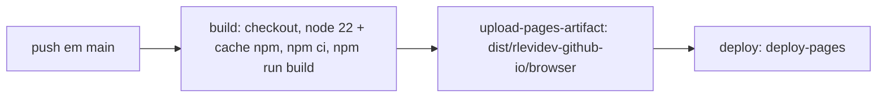

# Relatório de migração — HTML estático → Angular 21 + ng-brutalism

**Autor:** Raí Levi · **Data:** 2026-10-02 · **Branch:** `feat/angular-ng-brutalism-migration`

---

## 1. Resumo executivo

O portfólio passou de um único arquivo `index.html` autocontido (766 linhas de HTML + CSS + JS inline, sem build) para uma aplicação **Angular 21** com design system **ng-brutalism** e **Tailwind CSS v4**, com deploy automatizado via **GitHub Actions → GitHub Pages**.

O objetivo funcional não mudou: a landing page é a mesma, com as mesmas seções, o mesmo visual brutalista e as mesmas traduções PT/EN. O que mudou foi **como** isso é mantido e publicado.

| Métrica | Antes | Depois |
| --- | --- | --- |
| Arquivos versionados de código | 1 (`index.html`) | 51 |
| Linhas adicionadas | — | 10.521 |
| Linhas removidas | — | 768 (766 do `index.html` + 2 do README) |
| Build | nenhum (`<script>` inline) | `ng build` com budgets e hash de output |
| CI/CD | push direto no branch do Pages | workflow build + deploy |
| Conteúdo | markup + i18n em `data-i18n` | TypeScript tipado (`interface Translations`) |
| Estado | `setAttribute` manual em listeners | Signals + `effect` |
| Testes | inexistentes | `ng test` configurado (sem specs) |

---

## 2. O que foi removido

### 2.1 `index.html` monolítico (766 linhas)

O arquivo concentrava quatro responsabilidades que agora são separadas:

1. **Markup** das 4 seções + header + footer.
2. **CSS** de ~600 linhas: tokens, primitivas (`.hard`, `.chip`, `.btn`), layout por seção e responsividade.
3. **JavaScript** inline: listener de tema e listener de idioma, com `document.querySelector` + `getAttribute/setAttribute`.
4. **Strings de i18n** em atributos `data-i18n="proj_title"` espalhados pelo HTML.

Nada disso foi portado como arquivo único; cada parte ganhou um destino próprio.

---

## 3. O que foi criado

### 3.1 Toolchain Angular

| Arquivo | Papel |
| --- | --- |
| `package.json` | scripts `start` / `build` / `watch` / `test`; `packageManager: npm@11.19.0` |
| `package-lock.json` | lockfile com 8.458 linhas (Angular 21.2.25, ng-brutalism 0.2.0, Tailwind 4.3.3) |
| `angular.json` | builder `@angular/build:application`, budgets de produção (initial 500 kB warn / 1 MB erro; component style 4 kB / 8 kB), `outputHashing: all` |
| `tsconfig.json` | `strict`, `strictTemplates`, `noPropertyAccessFromIndexSignature`, `isolatedModules` |
| `tsconfig.app.json` / `tsconfig.spec.json` | projects da app e de specs |
| `.editorconfig` / `.prettierrc` / `.postcssrc.json` | UTF-8, 2 espaços, aspas simples, `printWidth: 100`, parser `angular` para HTML, plugin `@tailwindcss/postcss` |
| `.gitignore` | `node_modules`, `dist`, `.angular/cache`, editors, SO |
| `.vscode/{extensions,launch,tasks,mcp}.json` | extensão `angular.ng-template`, debug de `ng serve`/`ng test`, tasks npm, MCP do Angular CLI |

Schematics foram configurados com `skipTests: true` em todos os geradores — é um site de conteúdo, não uma aplicação com suíte de testes.

### 3.2 Bootstrap da aplicação

- `src/main.ts` — `bootstrapApplication(App, appConfig)`.
- `src/app/app.ts` — componente raiz, importa os 8 componentes de página, `ChangeDetectionStrategy.OnPush`.
- `src/app/app.config.ts` — registra `provideBrowserGlobalErrorListeners()` e **`provideNgBrutalism({ theme })`** com a paleta do portfólio injetada em runtime: `#F5C242`, `#FF5C93`, `#5FE0C0`, `#9B8CFA`, `radius: 0px`, `borderWidth: 3px`, offset de sombra `6px/6px`, Space Grotesk + Space Mono.
- `src/index.html` — shell enxuto, `<app-root>`, metadados OG e as fontes.

### 3.3 Componentes (8)

Todos com `OnPush`, template e style separados em arquivos próprios:

| Componente | Seletor | Seção | Componentes ng-brutalism usados |
| --- | --- | --- | --- |
| `SiteHeader` | `app-site-header` | header sticky | `NbButton`, `NbIconButton` |
| `Hero` | `app-hero` | `#hero` | `NbDisplay`, `NbText`, `NbCluster`, `NbStat`, `NbStatusDot`, `NbButton` |
| `SkillsMarquee` | `app-skills-marquee` | faixa rolante | `NbMarquee`, `NbMarqueeItem` |
| `Projects` | `app-projects` | `#projects` | `NbCard` + `NbCardHeader/Title/Content/Description/Actions`, `NbChip`, `NbChipGroup`, `NbStack`, `NbCluster`, `NbTypography`, `NbText`, `NbButton` |
| `Trajectory` | `app-trajectory` | `#trajectory` | `NbSplit`, `NbSurface`, `NbStack`, `NbSticker` |
| `Certifications` | `app-certifications` | `#certs` | `NbSection`, `NbStack`, `NbSticker` |
| `Contact` | `app-contact` | `#contact` | `NbSurface`, `NbButton`, `NbCluster` |
| `SiteFooter` | `app-site-footer` | rodapé | — |

`TerminalCard` é um nono componente, usado dentro do `Hero`.

Total de **22 componentes da biblioteca** em uso, todos importados explicitamente por componente (standalone, sem `NgModule`).

### 3.4 Camada de dados (`src/app/data/`)

- **`portfolio.data.ts`** — interfaces `Skill`, `Project`, `Stat` com campos `readonly` e unions literais (`status: 'done' | 'wip'`, `link: 'code' | 'open'`, `desc: 'proj1_desc' | ...`). Exports: `SKILLS` (7 skills com logo e cor de marca), `PROJECTS` (4 projetos), `STATS` (3), `SOCIALS` (LinkedIn, GitHub, e-mail).
- **`translations.ts`** — `type Lang = 'pt' | 'en'` + `interface Translations` com **48 chaves**, e `TRANSLATIONS: Record<Lang, Translations>`. Substitui os `data-i18n` por lookups tipados: `state.t()[project.desc]`.

O tipo-chave é o que garante que uma tradução não traduzida quebra o build (`strictTemplates` + acesso indexado pela union) em vez de renderizar `undefined`.

### 3.5 Estado (`src/app/state/portfolio-state.service.ts`)

`PortfolioState` é um `@Injectable({ providedIn: 'root' })` com dois signals:

```ts
readonly theme = signal<Theme>('light');
readonly lang  = signal<Lang>('pt');
readonly t: () => Translations = computed(() => TRANSLATIONS[this.lang()]);
```

Um `effect` no construtor sincroniza o signal com o DOM:

```ts
effect(() => {
  root.setAttribute('data-theme', this.theme());
  root.setAttribute('data-lang', this.lang());
  root.classList.toggle('dark', this.theme() === 'dark');
});
```

`toggleTheme()` e `toggleLang()` fazem `update()` com ternário. Componentes derivados usam `computed` (`themeIcon` → ☀/☾, `langLabel` → PT/EN).

### 3.6 Estilos

- **`src/styles.css`** (256 linhas) — importa `tailwindcss` e `@ng-brutalism/ui/styles.css`, define os tokens que a biblioteca não cobre (`--nb-background`, `--nb-foreground`, `--nb-border`, `--nb-shadow`, `--nb-surface`, `--nb-field-bg`) com variante dark, e mantém **aliases legados** (`--ink`, `--bg`, `--panel`, `--shadow-color`, `--yellow`, `--pink`, `--mint`, `--violet`) mapeados para os tokens do ng-brutalism — é isso que permitiu migrar o CSS existente quase linha a linha.
- **9 CSS de componente** com ViewEncapsulation padrão.
- **7 ícones SVG** em `public/icons/` (Go, Java, Docker, PostgreSQL, Claude Code, Git, Linux), 48 KB no total, servidos por `public/` e referenciados por `SKILLS[].icon`.
- `src/app/app.css` está vazio de propósito — o chrome do shell (`.page-frame`, cantos, rodapé) é compartilhado e vive no global.

Três decisões de CSS valem registro porque são correções, não estilo:

1. `overflow-x: clip` em vez de `hidden` no `html`/`body` — `hidden` computa `overflow-y: auto` e quebra `position: sticky` do header.
2. O `nbDisplay` da biblioteca escreve `font-size: var(--nb-display-size, 4.75rem)` inline, então o clamp responsivo do hero entra pelo **token** `--nb-display-size`, não por uma regra `font-size`.
3. O wrapper do `NbMarquee` tem `bg-white` fixo na biblioteca; por isso o chip de skill usa `color-mix(in srgb, var(--skill-brand) 12%, #fff)` em vez de `--panel` — logos multicoloridos (Tux, Java) perdem contraste na superfície escura.

### 3.7 CI/CD (`.github/workflows/deploy.yml`)



- Permissões mínimas: `contents: read`, `pages: write`, `id-token: write`.
- `concurrency: pages`, `cancel-in-progress: false` (não cancela deploy em voo).
- Também dispara por `workflow_dispatch`.

### 3.8 README

Substituído por documentação real: stack, `npm ci` / `npm start` / `npm run build`, caminho da saída, como o deploy funciona e a estrutura de `src/app/`.

---

## 4. Decisões técnicas

| Decisão | Alternativa descartada | Motivo |
| --- | --- | --- |
| Standalone components | `NgModule` | padrão do Angular 21; sem boilerplate, `imports` explícito por componente |
| `OnPush` em todos os 8 + app | detecção padrão | com signals, verificações são previsíveis e desnecessárias |
| Conteúdo em `.ts` tipado | `<content>`/JSON ou `data-i18n` | `strictTemplates` passa a checar traduções e status de projeto em build |
| Aliases de CSS legados | reescrever todo o CSS para `--nb-*` | migração quase mecânica do CSS antigo, sem regressão visual |
| Estado com signals em service root | `BehaviorSubject` / `localStorage` | API síncrona, sem boilerplate, sem `async` nos templates |
| Sem router | `provideRouter` com rotas | página única, sem navegação — `@angular/router` fica como dependência padrão não usada |
| Tailwind só como base | usar utilities utilitárias nos templates | CSS próprio do portfólio dá mais controle do design system; Tailwind alimenta o estilo do ng-brutalism |

---

## 5. Verificação executada

### Build de produção

```console
$ npm run build
Initial chunk files | Names  |  Raw size  | Estimated transfer size
main-H5K2YQS7.js         | main   | 238.94 kB  | 64.00 kB
styles-CR5QZU3E.css      | styles |  60.58 kB  |  9.95 kB
                    Initial total    299.52 kB  | 73.95 kB
Application bundle generation complete. [9.345 seconds]
```

Sem warning de budget (initial < 500 kB; styles de componente < 4 kB). Saída em `dist/rlevidev-github-io/browser`.

### Renderização real

Servido o bundle de produção em `http-server` e inspecionado em Chromium headless:

- Título `Raí Levi | Backend Engineer`; `<html>` inicia em `data-theme="light" data-lang="pt"`; 4 `<section>` presentes; 4 `nb-card` de projeto renderizados.
- **Zero erros e zero mensagens de console.**
- Toggle de tema: `light` → `dark`, com as duas paletas aplicadas ao frame, header, cards e bloco de contato.
- Toggle de idioma: `pt` → `en`; o `<h1>` passa de `SEM ATALHO.` para `NO SHORTCUTS.` e todas as seções re-renderizam em inglês (`Featured Projects`, `Certificates`, `coming soon`, `Let's build something together?`).
- Desktop (1365px) e mobile (390×844): sem overflow horizontal (`scrollWidth === clientWidth === 390`), cards em coluna única, marquee em full-bleed, header com nav quebrando para a segunda linha.
- Footer exibe `© 2026 Raí Levi <rlevi.dev@gmail.com>`.

---

## 6. Riscos e pendências

| Item | Severidade | Situação |
| --- | --- | --- |
| **Source do GitHub Pages** | 🔴 alta | O repositório está com Pages em `build_type: legacy`, `source: {branch: main, path: /}` — servindo a branch diretamente. O workflow assume **GitHub Actions** como source. Sem trocar em *Settings → Pages → Build and deployment → Source*, o primeiro deploy falha com "Get Pages site failed" ou o site continua servindo `main` cru. **Ação: trocar a source para GitHub Actions antes do merge.** |
| Sem testes automatizados | 🟡 média | `ng test` está configurado, mas não há specs. Aceitável para site de conteúdo; a lógica de risco real (i18n, `statusTone`) é validada pelo `strictTemplates` em build. |
| Sem persistência de preferências | 🟡 média | Tema e idioma **não** são salvos — a escolha se perde no reload. O site antigo também não persistia, então não é regressão, mas é a melhoria mais óbvia pendente (`localStorage` ou `prefers-color-scheme`). |
| i18n sem `data-i18n` | 🟢 baixa | Perde-se a inspeção de tradução pelo inspetor do browser; em troca ganha-se verificação em build. |
| `@angular/router`, `@angular/forms` | 🟢 baixa | Dependências padrão não utilizadas (site de página única). |
| Lockfile grande | 🟢 baixa | 8.458 linhas de `package-lock.json` — revisão por collapsing de diff. |

---

## 7. Como revisar

```bash
git switch feat/angular-ng-brutalism-migration
npm ci
npm start          # http://localhost:4200
```

Para o diff, ignore `package-lock.json` e comece por `src/app/state/portfolio-state.service.ts` e `src/app/data/translations.ts` — é onde mora a lógica real. O resto é markup e CSS migrado.
